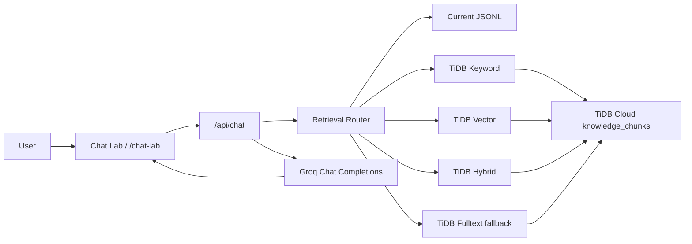

## はじめに

業務向けの「ナレッジに答えてくれるチャット」を提案しようとすると、最初に悩むのがコストでした。

大手クラウドのマネージド検索サービスやAI検索系の構成は強力ですが、提案段階の小さなPoCでも見積もりが重くなりやすい。実際の問い合わせが多いならまだ説明しやすいのですが、「ナレッジを保持しているだけ」の期間にも固定費が乗る構成だと、初期提案としては通しづらい場面がありました。

一方で、JSONを手で作って静的に検索するだけでは限界があります。特に、日々知見が蓄積されるタイプの業務では、週1回・月1回の手動更新が運用のボトルネックになります。

欲しかったのは、次のような仕組みです。

- 最初は小さく始められる
- ナレッジをDBに貯められる
- ユーザーや運用者がデータを登録すると、RAGの知識が育つ
- SQL検索、ベクトル検索、ハイブリッド検索を同じ基盤で試せる
- 回答生成は別のLLM APIに差し替えられる

そこで今回は、TiDB CloudとGroqを使って、既存WebサイトのFAQチャットをRAG化する実験をしました。

TiDB Cloud Starterは、公式ページ上で「25GiB storage and 250 million reads」まで無料枠があると案内されています（2026-06-20時点）。また、TiDBはSQLだけでなくVector Search/RAG用途も前面に出しているため、小さく始めるナレッジ基盤として相性がよさそうでした。

参考:

- https://www.pingcap.com/tidb-cloud-starter/
- https://www.pingcap.com/pricing/
- https://docs.pingcap.com/tidbcloud/vector-search-overview/

## 作ったもの

架空サービスサイト「NEURAMNESIA」のFAQ/予約/安全性/売却ページなどをナレッジ化し、チャットから質問できる検証ページを作りました。

構成は以下です。



Chat Labでは、次のように検索方式を切り替えられます。

- `Current JSONL`: 既存のローカルJSONL検索
- `TiDB Keyword`: TiDB上のLIKEベース検索
- `TiDB Vector Local`: TiDBのVECTOR列を使ったベクトル検索
- `TiDB Hybrid Local`: TiDB Vector + TiDB Keywordのrank fusion
- `TiDB Fulltext`: `MATCH ... AGAINST` を試し、未対応ならKeywordにフォールバック

通常のサービス画面であれば検索方式は `Hybrid` などに固定する想定ですが、今回は技術検証用のデモなので、あえて検索モードを画面上で切り替えられるようにしています。同じ質問を投げて、参照ソースや検索ログがどう変わるかを見られるようにするためです。

回答生成はGroqに投げています。つまり、検索はTiDB/JSONL側、回答生成はGroq側という分担です。

## ナレッジの保存先

TiDBには `knowledge_chunks` という1テーブルを作りました。

```sql
CREATE TABLE IF NOT EXISTS knowledge_chunks (
  id BIGINT AUTO_INCREMENT PRIMARY KEY,
  record_id VARCHAR(191) NOT NULL,
  chunk_id VARCHAR(191) NOT NULL,
  title VARCHAR(512) NOT NULL,
  content TEXT NOT NULL,
  url VARCHAR(1024),
  kind VARCHAR(128),
  source_path VARCHAR(512),
  chunk_index INT NOT NULL DEFAULT 0,
  metadata JSON,
  content_hash CHAR(64) NOT NULL,
  embedding VECTOR(1536),
  embedding_model VARCHAR(128),
  embedding_dimensions INT,
  is_active TINYINT(1) NOT NULL DEFAULT 1,
  created_at TIMESTAMP NOT NULL DEFAULT CURRENT_TIMESTAMP,
  updated_at TIMESTAMP NOT NULL DEFAULT CURRENT_TIMESTAMP ON UPDATE CURRENT_TIMESTAMP,
  UNIQUE KEY uk_knowledge_chunks_chunk_id (chunk_id),
  KEY idx_knowledge_chunks_record_id (record_id),
  KEY idx_knowledge_chunks_kind (kind),
  KEY idx_knowledge_chunks_active_updated (is_active, updated_at)
);
```

最初は既存のReactデータから `docs/rag/knowledge.jsonl` を生成し、それをTiDBへupsertしました。

```bash
npm run rag
npm run rag:tidb:import
```

今回は外部Embedding APIキーなしでもVector Searchを試せるように、検証用の `local-hash-ngram-v1` というローカルembeddingも用意しました。

```bash
npm run rag:tidb:import-local-vector
```

このローカルembeddingは本番の意味検索用ではありません。あくまで、TiDBのVECTOR列とベクトル検索経路を検証するための簡易embeddingです。本番ではOpenAI Embeddingsなど、用途に合うembedding providerへ差し替える想定です。

## Groqで回答生成する

APIでは、まず検索モードに応じてRAGコンテキストを取得し、その結果をGroqに渡します。

リクエスト例:

```json
{
  "message": "予約の流れを短く教えてください",
  "provider": "groq",
  "retrievalMode": "tidb",
  "tidbSearchMode": "hybrid",
  "embeddingProvider": "local"
}
```

レスポンスには、回答だけでなく検索モード、参照ソース、簡単な処理ログも返すようにしました。

```json
{
  "retrievalMode": "tidb-hybrid",
  "provider": "groq",
  "sources": [
    "BookingPage (https://novamnesis-laboratories.vercel.app/booking)"
  ],
  "generation": {
    "provider": "groq",
    "generated": true,
    "error": null
  }
}
```

この形にしておくと、Chat Lab上で「どの検索方式が効いているか」「Groq生成に成功したか」「どのソースが使われたか」を確認できます。

## 検索方式

### 1. Current JSONL

もともとの簡易実装です。ローカルJSONLを読み、タイトルや本文に対して軽いスコアリングをします。

小規模ならこれでも動きますが、ナレッジが増えたり、ユーザーが登録したデータを蓄積したりする用途には向きません。

### 2. TiDB Keyword

TiDBに保存した `title/content/kind` に対して、LIKEベースでスコアリングします。

日本語の質問に対して、完全な自然言語検索ではありませんが、サイト内FAQやページ単位のナレッジではかなり実用的でした。

### 3. TiDB Vector Local

`embedding VECTOR(1536)` に入れたベクトルを使い、`VEC_COSINE_DISTANCE` で近いチャンクを取得します。

ただし今回は検証用のローカルhash embeddingなので、意味検索の精度は高くありません。実際、後述のベンチマークではVector単体の精度は低めでした。

### 4. TiDB Hybrid Local

Vector検索とKeyword検索を両方走らせ、順位を融合します。

今回の実験では、Vector単体で荒れた結果をKeywordが補正し、実用上かなり安定しました。

### 5. TiDB Fulltext

TiDB CloudのFULLTEXT検索を試すために、以下のインデックスも用意しました。

```sql
CREATE FULLTEXT INDEX IF NOT EXISTS idx_knowledge_chunks_fulltext
ON knowledge_chunks (title, content);
```

ただし、今回使ったTiDB環境では `MATCH ... AGAINST` が `UnknownType: *ast.MatchAgainst` になりました。そのため、実装ではFULLTEXTが失敗した場合にKeyword検索へフォールバックしています。

これは記事にするうえでは、むしろ良い知見でした。RAG基盤では「使える検索方式を試す」だけでなく、「環境差や未対応機能にどう落とすか」も設計に含める必要があります。

## ベンチマーク

5つの質問を、5つの検索モードで1回ずつ実行しました。回答生成はGroqです。

質問セット:

- 予約の流れを短く教えてください
- 体験後の副作用や安全性について教えてください
- 初心者におすすめの体験メニューはありますか
- 記憶を売却する場合の流れと査定について教えてください
- 駐車場とキャンセル料について教えてください

実行コマンド:

```bash
npm run rag:benchmark -- --rounds=1 --delay-ms=3000
```

結果:

| Mode | Runs | Avg ms | P50 ms | P95 ms | Source hit | Top source hit | LLM generated | Fallbacks |
|---|---:|---:|---:|---:|---:|---:|---:|---:|
| Current JSONL | 5 | 534 | 659 | 1011 | 100% | 60% | 60% | 0 |
| TiDB Keyword | 5 | 892 | 891 | 1934 | 100% | 100% | 80% | 1 |
| TiDB Vector Local | 5 | 435 | 488 | 712 | 40% | 0% | 60% | 0 |
| TiDB Hybrid Local | 5 | 707 | 660 | 884 | 100% | 80% | 100% | 0 |
| TiDB Fulltext | 5 | 513 | 617 | 962 | 100% | 100% | 60% | 5 |

今回の指標はざっくり以下です。

- `Source hit`: 期待したソース、または範囲外質問に対して「データなし」と判断できたか
- `Top source hit`: 先頭ソースが期待どおりだったか
- `LLM generated`: Groqで回答生成できたか
- `Fallbacks`: FULLTEXT失敗時などに別検索へ落ちた回数

## 結果から分かったこと

### TiDB Keywordはかなり堅い

`TiDB Keyword` は `Top source hit` が100%でした。

今回のようなFAQ/ページ本文ベースのナレッジでは、最初から高度なVector検索を入れなくても、きちんとトークン設計とスコアリングをすれば十分戦える印象です。

### Vector単体はembedding品質に強く依存する

`TiDB Vector Local` は速い一方で、`Top source hit` は0%でした。

これはTiDBのVector Searchが悪いというより、今回使った `local-hash-ngram-v1` が意味検索用のembeddingではないためです。

むしろ、ここは記事として重要なポイントです。

> Vector Searchを使えば自動的に賢くなるわけではなく、embedding設計が検索品質を大きく左右する。

本番で使うなら、OpenAI Embeddingsなどの意味ベクトルを使って再検証したいところです。

### Hybridは実用的だった

`TiDB Hybrid Local` は `Source hit` 100%、`Top source hit` 80%、`LLM generated` 100%でした。

Vector単体では荒れた結果も、Keywordと組み合わせることでかなり安定しました。

今回のように「タイトルや本文に明確な語があるナレッジ」では、Keywordを軸にしつつ、Vectorで補助する形が現実的だと感じました。

### FULLTEXTは環境差を考える必要がある

FULLTEXTは実装しましたが、今回のTiDB環境では `MATCH ... AGAINST` が使えず、全件でKeywordへフォールバックしました。

レポートには以下のように残っています。

```text
TiDB検索は tidb-fulltext-error: UnknownType: *ast.MatchAgainst。tidb-keyword へフォールバックしました。
```

RAG基盤としては、こういう「使えるなら使う、無理なら落とす」という設計にしておくと安心です。

### Groqのレート制限も観測できた

ベンチマーク中、GroqのTPMレート制限に当たったケースがありました。

その場合は、LLM回答生成をスキップし、検索結果ベースのフォールバック回答を返すようにしています。

これも実運用では重要です。RAGチャットは「検索」と「生成」を分けて見るべきで、LLM側の一時失敗があっても、検索結果や参照ソースは返せる設計にしておくと壊れにくくなります。

## コスト面で感じたこと

今回一番試したかったのは、技術的な面だけではありません。

「問い合わせが来た時だけLLMを呼び、ナレッジ自体は低コストなDBに蓄積する」という構成が、提案ベースで現実的かどうかを見たかった。

この点でTiDB Cloud Starterはかなり相性がよさそうでした。

- SQLで普通に扱える
- JSONメタデータも持てる
- Vector列も持てる
- 最初は無料枠で試せる
- ナレッジをDBに寄せられるので、将来的に管理画面や登録導線を作りやすい

今回は静的JSONLから投入しましたが、本当にやりたいのは「ユーザーや運用者が管理画面から登録すると、ナレッジが育つ」形です。

その場合でも、基盤がTiDBなら、最初は1テーブルから始めて、あとから承認フロー、カテゴリ、公開/非公開、監査ログなどを足していけそうです。

## まとめ

今回、TiDB CloudとGroqで小さなRAGチャットを作り、複数の検索方式を比較しました。

分かったことは以下です。

- FAQ/ページ本文ベースのナレッジでは、TiDB Keywordがかなり堅い
- Vector Searchは動かせたが、精度はembedding品質に大きく依存する
- Hybrid検索は、Keywordの堅さとVectorの拡張性を両立しやすい
- FULLTEXTは環境差を考慮してフォールバック設計にした方がよい
- Groq生成は速いが、レート制限時のフォールバックも必要
- TiDBにナレッジを寄せると、将来的に「育つナレッジベース」にしやすい

大きなマネージド検索基盤をいきなり組む前に、TiDB Cloud Starter + Groqで小さく検証するのはかなり現実的だと感じました。

今回のような構成なら、最初はJSONLから始めて、次にTiDBへ移し、最後に管理画面や自動登録フローを足していく、という段階的な提案がしやすそうです。

「ナレッジを保持しているだけで重い固定費がかかる」構成を避けつつ、必要になったらSQL、Vector、Hybrid検索へ広げられる。そこが、この構成の一番の魅力でした。
